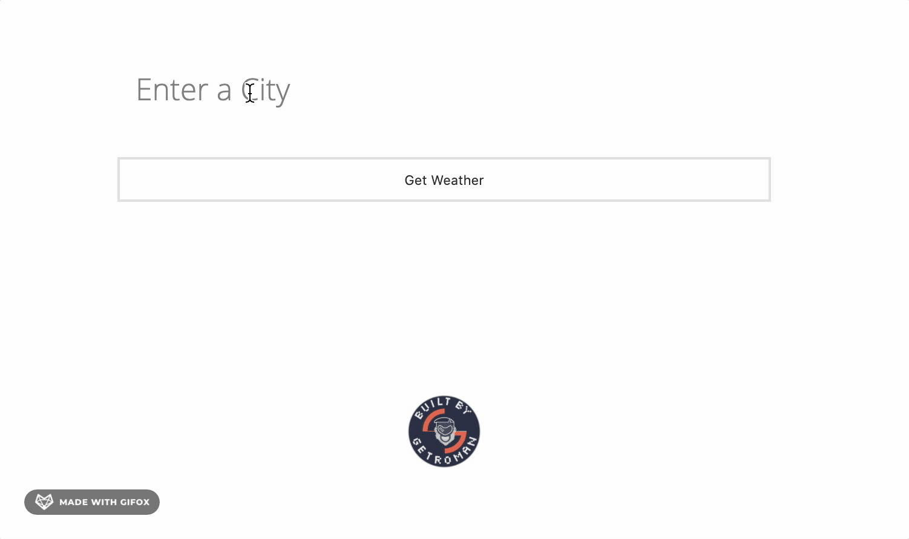

### OpenWeather API App with Node.js
--- 
>This app was built using OpenWeather API that accesses current weather. Embedded Javascript Templates to generate HTML markup with plain JavaScript, Express.js for API consumption, and Heroku for hosting and deployment.

### Live Demo 
---
https://getromanweatherappjs.herokuapp.com/

### Tech Stack
---
```Scaffolding```
- HTML

```Styling```
- CSS

```Behavior```
- Javascript
- Embedded Javascript Templates (EJS)

```Deployment/Hosting Infrastructure```
- Heroku

### License
---
[](https://opensource.org/licenses/ISC)